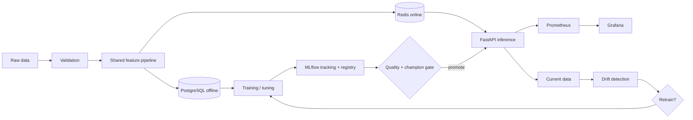

# Production ML Platform

[](https://github.com/codewithmmui/production-ml-platform/actions/workflows/ci.yml) [](https://github.com/codewithmmui/production-ml-platform/actions/workflows/security.yml) [](https://www.python.org/) [](LICENSE)

An end-to-end, production-oriented customer churn ML system—not a notebook demo. It owns the path from deterministic data generation and validation through shared feature engineering, model comparison, MLflow tracking, guarded promotion, FastAPI inference, Prometheus/Grafana monitoring, drift detection, champion/challenger retraining, containers, Kubernetes, Helm, and CI/security automation.

## Engineering highlights

- Deterministic synthetic behavioral data with meaningful label relationships, missingness, imbalance, and controlled shift
- Strict schema/range/category/uniqueness contracts and leakage-safe sklearn pipelines
- PostgreSQL offline and Redis online feature-store adapters with freshness semantics
- Three candidate models, imbalance-aware selection, tuning, test metrics, lineage, and explicit quality gates
- Fail-safe API with readiness distinct from liveness, request IDs, bounded validation, JSON logs, and low-cardinality metrics
- Drift-aware retraining that creates a challenger; production is never blindly overwritten
- Non-root containers, least-privilege Kubernetes manifests, HPA, NetworkPolicy, and automated supply-chain scans

## Architecture



Offline features build reproducible point-in-time training sets. Online features serve low-latency entity lookups; the same versioned transformation code limits training-serving skew. See [architecture](docs/architecture.md) and [feature store](docs/feature-store.md).

## Quick start

Requires Python 3.12+.

```bash
cp .env.example .env
python3 -m venv .venv && . .venv/bin/activate
make install
make generate-data
make train
make serve
```

Then open `http://localhost:8000/docs`. The training command writes trusted local artifacts under `artifacts/` and records MLflow lineage under `mlruns/` by default.

For the service stack (the API image trains a deterministic bootstrap model in its builder stage,
so this also works from a clean checkout):

```bash
docker compose up --build
```

This starts API (8000), MLflow (5000), Prometheus (9090), Grafana (3000), PostgreSQL,
and Redis. Local fallback passwords are development-only; override them in `.env`. The bootstrap
model makes the image independently buildable; production promotion should replace it with a
digest-verified artifact from the registry rather than rebuilding an image ad hoc.

## Training and evaluation

`make train` performs stratified train/validation/test splits. Preprocessing is fit only on training data. Logistic regression, random forest, and histogram gradient boosting compete on validation PR-AUC (then ROC-AUC); the winner is refit on train+validation and evaluated once on test. `--tune` activates a bounded randomized search where applicable.

Runs record parameters, test metrics, confusion matrix, selected model, dataset SHA-256, timestamp, and Git SHA. Promotion requires configured ROC-AUC, PR-AUC, F1, latency, and champion improvement. Registry lifecycle is expressed with MLflow aliases: `candidate` → `staging` → `production`; displaced versions become `archived`. Artifact loading is limited to pipeline-generated, trusted files—never user uploads.

No benchmark or model metric is claimed in source. Run training and `python scripts/load_test.py` against a live API; record the actual machine/runtime context alongside results.

## API

Endpoints: `GET /`, `/health`, `/ready`, `/metrics`, `/model/info`; `POST /predict`, `/predict/batch`, `/explain`.

```bash
curl -s http://localhost:8000/predict -H 'content-type: application/json' -d '{
  "customer_id":"CUST-10001","tenure_months":13,"monthly_spend":79.99,
  "total_spend":1020.50,"support_tickets":4,"login_frequency":3,
  "subscription_plan":"premium","payment_failures":2,"days_since_last_login":15,
  "usage_score":0.42,"contract_type":"monthly","region":"south"}'
```

Responses include class, calibrated model probability, model version, and request ID. Explanation is deliberately isolated from basic prediction availability and returns transparent risk factors; model-specific global importance is retained during evaluation.

## Monitoring, drift, and retraining

Prometheus collects request/error rate, latency histograms, prediction mix, model status, drift, and feature-store latency. Grafana provisions a dashboard automatically. Numeric drift combines KS and PSI; categorical drift uses Jensen-Shannon divergence. Thresholds live in `configs/monitoring.yaml`.

The retraining pipeline validates new data, stops below the drift threshold, trains a challenger above it, applies absolute quality gates and required champion improvement, and records the decision. Rollback moves the prior verified registry version back to the `production` alias; see the [runbook](docs/runbook.md).

## Deployment and operations

```bash
kubectl apply -f kubernetes/namespace.yaml
kubectl apply -f kubernetes/
helm lint helm/production-ml-platform
helm upgrade --install ml-platform helm/production-ml-platform
```

Replace image owner and provision `ml-platform-secrets` through an external secret manager. Kubernetes assets include probes, resource budgets, non-root/security contexts, HPA, and NetworkPolicy. PostgreSQL manifests are suitable for development; production should use managed HA PostgreSQL/Redis with backups and TLS.

## Development and repository map

`src/ml_platform` contains data, features, training, inference, API, monitoring and pipelines. `tests` separates unit/integration tests; `docker`, `kubernetes`, `helm`, and `monitoring` contain deployment assets; `docs` contains architecture, lifecycle, security, ADRs, and operational procedures.

```bash
make lint
ruff format --check .
make typecheck
make coverage
make smoke-test
```

CI repeats these checks and builds the API image. Security automation runs pip-audit, Gitleaks, and Trivy. Tagged releases publish to `ghcr.io/<owner>/production-ml-platform` using GitHub's scoped token.

## Security and reliability

No credentials or generated data/models are committed. Inputs reject unknown fields and invalid categories/ranges. Client errors never expose tracebacks. Readiness fails when the model is absent while liveness remains available for diagnosis. Redis/PostgreSQL failures are surfaced explicitly rather than silently changing prediction semantics. See [security](docs/security.md) and [runbook](docs/runbook.md).

## Future improvements

Point-in-time feature joins at warehouse scale, signed model artifacts/SBOM attestation, canary rollout with outcome feedback, distributed training, a managed secrets operator, and an event-driven feature materializer.

## License

MIT.
