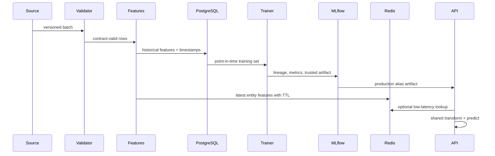

# Architecture

## Boundaries and flow

Data ingestion owns raw contracts; feature engineering owns transformations; stores own persistence; training owns splits/model selection; the registry owns lifecycle; inference owns trusted loading; the API owns transport; monitoring owns telemetry. This keeps training dependencies out of serving evolution where possible.

The offline path favors reproducibility and history. The online path favors keyed latency and freshness. Versioned feature metadata and a shared transformer constrain skew; production systems should add event-time point-in-time joins and materialization audits.

API pods scale horizontally because model state is immutable. Redis/PostgreSQL should be managed, replicated services in production. Model artifacts belong in object storage with digest/signature verification. If Redis fails, explicit request features can still be predicted; a lookup requiring Redis fails with a typed 503. If PostgreSQL fails, serving continues but materialization/training pauses. If model loading fails, `/health` stays diagnostic and `/ready` returns 503.
